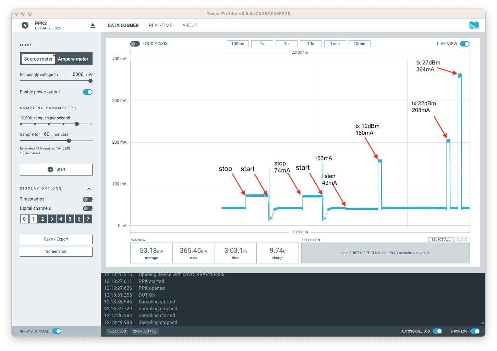
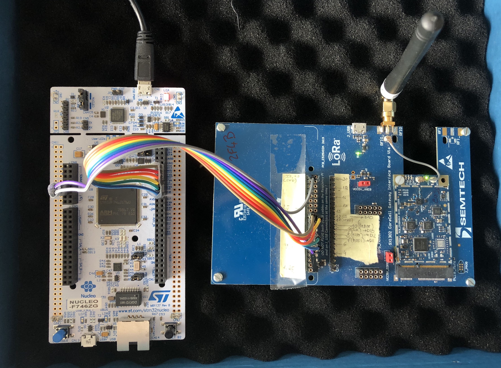
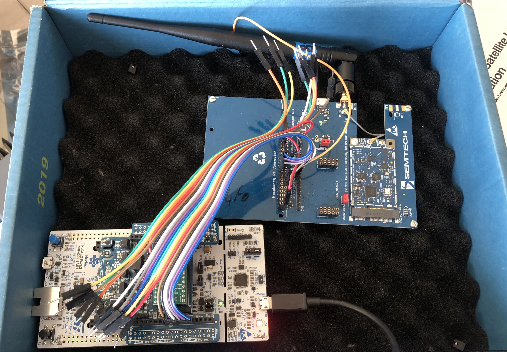

# Semtech SX1302 Concentrator LoRa Driver Test

## About

This is a interactive shell test for Semtech SX1302 LoRa radio.

If you have other hardware (boards, Semtech based LoRa module), you can adapt
the configuration to your needs by copying an adapted version of
`drivers/sx1302/include/sx1302_params.h` file to your application directory.

## Setup

```bash
export RIOTBASE=~/github/RIOT-OS/RIOT
cd ~/github/thingsat/riot-modules
cd app/driver_sx1302
```

For Nucleo F446RE (default board)
```bash
gmake -j 8 flash
```

For Nucleo F429ZI
```bash
gmake BOARD=nucleo-f429zi -j 8 flash
```

For Nucleo F429ZI + [X-NUCLEO-IKS01A3 MEMS shield](https://www.st.com/resource/en/data_brief/x-nucleo-iks01a3.pdf)
```bash
gmake BOARD=nucleo-f429zi IKS01A3=yes -j 8 flash
```

## Tested boards

* [x] Nucleo F446RE (`BOARD=nucleo-f446re`)
* [x] Nucleo F446ZE (`BOARD=nucleo-f446ze`)
* [x] Nucleo F429ZI (`BOARD=nucleo-f429zi`)
* [x] Nucleo F429ZI + X-NUCLEO-IKS01A3 MEMS shield (`BOARD=nucleo-f429zi IKS01A3=yes`)
* [x] Nucleo F746ZG (`BOARD=nucleo-f746zg`)
* [ ] Nucleo F439ZI (`BOARD=nucleo-f439zi`)
* [x] STM32 F746G Disco (`BOARD=stm32f746g-disco`)

## Wiring

Using the SX1302 CoreCell Gateway Interface Board V1a, and a Nucleo-64 or Nucleo-144 with Shield:

| Nucleo F446RE  | CN1 |
| -------------- | --- |
| GND            | 39  |
| 5V             | 2   |
| POWER EN (D8)  | 12  |
| RESET    (D9)  | 16  |
| CS       (D10) | 24  |
| MOSI     (D11) | 19  |
| MISO     (D12) | 21  |
| CLK      (D13) | 23  |

with CN1 being the 40 pins connector, starting with 1 in top left:  
1 3 5 ...  
2 4 6 ...  


## TODO


* [x] Add ENABLE_FSK section  (for reducing module footprint)
* [x] Add ENABLE_SX125X section (for reducing module footprint)
* [x] add start and stop gateway
* [x] add LoRaWAN frame decoder (DTUP, JREQ, DevADDR, DevEUI, FCnt  ...).
* [x] add time on air for passing after TX.
* [x] add time on air for rx pkt displaying.
* [x] fix LoRa service band SF7BW250.
* [x] fix "WARNING: not enough space allocated, fetched 21 packet(s), 5 will be left in RX buffer" 
* [x] set pa_gain and pwr_idx for TX according txpower (lgw tx and lgw bench)
* [x] add a thread for receiving packet (lgw listen).
* [x] add a command for stopping the rx thread (lgw idle).
* [x] add RTC and timestamp into packet.
* [x] add idle cmd for stopping the RX.
* [x] test on nucleo-f429zi
* [ ] add temperature cmd for setting fake temperature.
* [ ] add documentation on I2C wires for STTS751 temperature sensor.
* [ ] add stts751 driver (available on the Corecell board : driver should be activated after corecell power on).
* [ ] add SAUL temperature into the SX1302 driver (see ).
* [ ] print map of rssi correction (temp versus rssi)
* [ ] improve stats (rx_ok, ...).
* [ ] what is single_input_mode ?
* [ ] add command for sending beacons
* [ ] find the minimal size for THREAD_STACKSIZE_MAIN and LGW_LISTEN_STACKSIZE
* [ ] add command for repeater with filtering (lgw repeater) --> Thingsat mission scenario
* [ ] add command for forwarder  (lgw forwarder) for boards with ethernet or wifi network interfaces
* [ ] add command for transmit beacon (lgw beacon)
* [ ] determine the end of the transmit !
* [ ] avoid to received the TX when iq_invert is false (Try lgw bench 10 12 125 8 22 on true 64 1000 and lgw bench 10 12 125 8 22 on false 64 1000)
* [ ] Mettre à jour le code par rapport à la nouvelle HAL :[loragw_spi.c (6291e62 Jul 2019)](https://github.com/Lora-net/sx1302_hal/blob/6291e62ef9a161ae41037a0df1a86e9943a907b9/libloragw/src/loragw_spi.c) VS [loragw_spi.c (master)](https://github.com/Lora-net/sx1302_hal/blob/master/libloragw/src/loragw_spi.c)
* [ ] add RTC timestamp into TX frame payload
* [ ] add GPS lat,lon,alt into TX frame payload (SAUL driver ?)
* [ ] add temperature into TX frame payload
* [ ] add fixed size into TX command (for beacon)
* [ ] add timeout into rx_cmd and listen_cmd commands
* [ ] add public operator name of the devaddr
* [ ] test `eu433` configuration

## RX Thread Stack

In case of **"RIOT kernel panic: MEM MANAGE HANDLER" error**, enlarge the stack of the thread running the RX cmd 


```
> lgw rx 10000 4
rxpkt buffer size is set to 4
Waiting for packets...
WARNING: not enough space allocated, fetched 11 packet(s), 7 will be left in RX buffer
*** RIOT kernel panic:
MEM MANAGE HANDLER

*** halted.

Inside isr -12
```

```makefile

CFLAGS += -DTHREAD_STACKSIZE_MAIN=65536U

```

## Testing

This test application provides low level shell commands to interact with the SX1302 modules.

Once the board is flashed and you are connected via serial to the shell, use the help command to display the available commands:

```
main(): This is RIOT! (Version: 2023.04-devel-682-gc4400)
=========================================
SX1302 Driver Test Application
Copyright (c) 2021-2022 UGA CSUG LIG
=========================================
> saul
ID      Class           Name
#0      ACT_SWITCH      LD1(green)
#1      ACT_SWITCH      LD2(blue)
#2      ACT_SWITCH      LD3(red)
#3      SENSE_BTN       B1(User button)
#4      SENSE_TEMP      hts221
#5      SENSE_HUM       hts221
#6      SENSE_GYRO      l3gxxxx
#7      SENSE_PRESS     lps22hh
#8      SENSE_TEMP      lps22hh
> saul read 8
Reading from #8 (lps22hh|SENSE_TEMP)
Data:             26.07 ?°C
> rtc settime 2023-03-20 15:12:53
> rtc gettime
2023-03-20 15:13:02
> help
Command              Description
---------------------------------------
lgw                  LoRa gateway commands
pm                   interact with layered PM subsystem
ps                   Prints information about running threads.
reboot               Reboot the node
rtc                  control RTC peripheral interface
version              Prints current RIOT_VERSION
> lgw
lgw reset    : Reset the SX1302
lgw status   : Get the SX1302 status
lgw start    : Start the gateway
lgw stop     : Stop the gateway
lgw stat     : Get stats of the gateway
lgw eui      : Get the concentrator EUI
lgw rx       : Receive radio packet(s)
lgw listen   : Receive radio packet(s) in background Stop to receive radio packet(s) in background (remark: the)
lgw idle     : Stop to receive radio packet(s) in background
lgw tx       : Transmit one radio packet
lgw bench    : Transmit a sequence of radio packets
lgw reg_test : Test writing and reading from registers
> lgw reset
Set power and reset
> lgw start
SX1302 Lib Version: 1.0.4; (RIOT port)
Set power and reset
RX frequency plan :
CH0     Radio B         868.100MHz 
CH1     Radio B         868.300MHz 
CH2     Radio B         868.500MHz 
CH3     Radio A         867.100MHz 
CH4     Radio A         867.300MHz 
CH5     Radio A         867.500MHz 
CH6     Radio A         867.700MHz 
CH7     Radio A         867.900MHz 
CH8     Radio B         868.300MHz      250kHz (LoRa service band)
INFO: Configuring SX1250_0 in single input mode
INFO: Configuring SX1250_1 in single input mode
Gateway started
> lgw eui
Concentrator EUI: 0x0016C00100002F4A
> lgw start
ERROR: the gateway is already started
> lgw listen
rxpkt buffer size is set to 4
Waiting for packets...
> 
----- LoRa packet - TimeOnAir: 51 msec (2023-03-20 15:14:06) -----
  count_us: 25756423 (delta: 0)
  size:     21
  chan:     1
  status:   0x10 CRC_OK
  datr:     7
  codr:     1
  rf_chain  1
  freq_hz   868300000
  snr_avg:  0.5
  rssi_chan:-129.6
  rssi_sig :-132.6
  temp     :20.0
  rssi_off :0.8
  crc:      0x319E
80 4B AC 00 FC 80 07 00 01 08 CB AD C4 02 D6 70 58 60 9C B1 ED 
DTUP (CONFIRMED): devaddr=FC00AC4B fcnt=7 fport=177 adr=on mic=EDB19C60
Received 1 packets (total:1)

----- LoRa packet - TimeOnAir: 51 msec (2023-03-20 15:14:09) -----
  count_us: 28381455 (delta: 2625032)
  size:     21
  chan:     7
  status:   0x10 CRC_OK
  datr:     7
  codr:     1
  rf_chain  0
  freq_hz   867900000
  snr_avg:  -3.5
  rssi_chan:-131.6
  rssi_sig :-136.6
  temp     :20.0
  rssi_off :0.8
  crc:      0x4083
80 4B AC 00 FC 80 08 00 01 4B 2D 65 A7 F7 38 27 DB 9D BF B0 E2 
DTUP (CONFIRMED): devaddr=FC00AC4B fcnt=8 fport=176 adr=on mic=E2B0BF9D
Received 1 packets (total:2)


> lgw start
[sx1302_reset] set power and reset
RX frequency plan :
CH0     Radio B         868.100MHz 
CH1     Radio B         868.300MHz 
CH2     Radio B         868.500MHz 
CH3     Radio A         867.100MHz 
CH4     Radio A         867.300MHz 
CH5     Radio A         867.500MHz 
CH6     Radio A         867.700MHz 
CH7     Radio A         867.900MHz 
CH8     Radio B         868.300MHz      250kHz (LoRa service band)
Select channel mode 0  (LoRaWAN-like)
> lgw eui
Concentrator EUI: 0x0016C00100002F4A
> lgw rx 4 4
rxpkt buffer size is set to 16
Waiting for packets...

rxpkt buffer size is set to 4
Waiting for packets...
WARNING: not enough space allocated, fetched 11 packet(s), 7 will be left in RX buffer

----- LoRa packet - TimeOnAir: 370 msec (2022-01-01 11:24:17) -----
  count_us: 236351211 (delta: 23)
  size:     23
  chan:     0
  status:   0x10 CRC_OK
  datr:     10
  codr:     1
  rf_chain  1
  freq_hz   868100000
  snr_avg:  12.0
  rssi_chan:-36.6
  rssi_sig :-36.6
  temp     :20.0
  rssi_off :0.8
  crc:      0x3ABF
00 32 46 52 41 44 B2 18 00 A0 0C 02 00 00 B2 18 00 85 9B 40 28 9E AE 
JREQ: deveui=0x0018B20000020CA0 joineui=00018B24441524632 devnonce=9B85 mic=AE9E2840

----- LoRa packet - TimeOnAir: 370 msec (2022-01-01 11:24:17) -----
  count_us: 236351218 (delta: 7)
  size:     23
  chan:     2
  status:   0x11 BAD_CRC
  datr:     10
  codr:     1
  rf_chain  1
  freq_hz   868500000
  snr_avg:  -7.8
  rssi_chan:-92.6
  rssi_sig :-98.6
  temp     :20.0
  rssi_off :0.8
  crc:      0xFA73
00 32 46 52 41 44 B2 18 00 A0 0C 02 03 00 B2 18 00 86 07 48 28 9E AE 
JREQ: deveui=0x0018B20003020CA0 joineui=00018B24441524632 devnonce=0786 mic=AE9E2848
Received 3 packets (total:34)
Note: remaining 7 packets in RX buffer, do not fetch sx1302 yet...

Exiting

Nb valid packets received: 4 CRC OK

> REM TX as an endpoint (crc=on invert_iq=false)
> lgw tx 867500 12 125 8 22 on false 40341200FC00000202090A0B0C0D0E0F101112131415161718191A1B1C1D1E1F
Transmitting LoRa packet on 867.500MHz [SF7BW125, TXPOWER 12, PWID 15, PA OFF, ToA 72 msec]
40 34 12 00 FC 00 00 02 02 09 0A 0B 0C 0D 0E 0F 10 11 12 13 14 15 16 17 18 19 1A 1B 1C 1D 1E 1F 
Waiting 72 msec


> REM TX as an endpoint (crc=on invert_iq=false)
> lgw tx 867500 7 125 8 12 on false 40341200FC00000202090A0B0C0D0E0F101112131415161718191A1B1C1D1E1F
Transmitting LoRa packet on 867.500MHz [SF7BW125, TXPOWER 12, PWID 15, PA OFF, ToA 72 msec]
40 34 12 00 FC 00 00 02 02 09 0A 0B 0C 0D 0E 0F 10 11 12 13 14 15 16 17 18 19 1A 1B 1C 1D 1E 1F 
Waiting 72 msec

> REM TX as an endpoint on LoRaWAN service channel (crc=on invert_iq=false)
> lgw tx 868300 7 250 8 12 on false 40341200FC00000202090A0B0C0D0E0F101112131415161718191A1B1C1D1E1F
Transmitting LoRa packet on 868.300MHz [SF7BW250, TXPOWER 12, PWID 15, PA OFF, ToA 36 msec]
40 34 12 00 FC 00 00 02 02 09 0A 0B 0C 0D 0E 0F 10 11 12 13 14 15 16 17 18 19 1A 1B 1C 1D 1E 1F 
Waiting 36 msec

> REM TX as a gateway (crc=off invert_iq=true)
> lgw tx 868500 7 125 8 12 off true 60341200FC00000202090A0B0C0D0E0F101112131415161718191A1B1C1D1E1F
Transmitting LoRa packet on 868.500MHz [SF7BW125, TXPOWER 12, PWID 15, PA OFF, ToA 72 msec]
60 34 12 00 FC 00 00 02 02 09 0A 0B 0C 0D 0E 0F 10 11 12 13 14 15 16 17 18 19 1A 1B 1C 1D 1E 1F 
Waiting 72 msec

> REM TX as an endpoint (crc=on invert_iq=false)
> lgw bench 3 7 125 8 12 on false 32 500
Transmitting LoRa packet on 868.500MHz [SF7BW125, PWID : 22, PA OFF, ToA 72 msec]
40 34 12 00 FC 00 00 01 02 09 0A 0B 0C 0D 0E 0F 10 11 12 13 14 15 16 17 18 19 1A 1B 1C 1D 1E 1F 
Waiting 572 msec
Transmitting LoRa packet on 868.300MHz [SF7BW125, PWID : 22, PA OFF, ToA 72 msec]
40 34 12 00 FC 00 00 02 02 09 0A 0B 0C 0D 0E 0F 10 11 12 13 14 15 16 17 18 19 1A 1B 1C 1D 1E 1F 
Waiting 572 msec
Transmitting LoRa packet on 868.100MHz [SF7BW125, PWID : 22, PA OFF, ToA 72 msec]
40 34 12 00 FC 00 00 03 02 09 0A 0B 0C 0D 0E 0F 10 11 12 13 14 15 16 17 18 19 1A 1B 1C 1D 1E 1F 
Waiting 572 msec


> REM Conso 170mA @ 3V3
> lgw bench 10 12 125 8 14 on false 64 1000
...

> REM Conso 220mA @ 3V3
> lgw bench 10 12 125 8 22 on false 64 1000
...

> REM Conso 300mA @ 3V3
> lgw bench 10 12 125 8 27 on false 64 1000
...


> lgw stat

----- stat -----
  rx       : 4
  rx_ok    : 4
  rx_bad   : 0
  rx_nocrc : 0
  tx       : 7

> lgw stop
[sx1302_poweroff] disable power


> lgw start
> lgw listen
> lgw stat

----- stat (2023-03-20 15:17:39) -----
  rx       : 5
  rx_ok    : 5
  rx_bad   : 0
  rx_nocrc : 0
  tx       : 1


> lgw idle
> lgw stat reset

```


# RF Power study
 
rfpower: RF power in dBm (12 .. 27).

with HackRFOne (`gqrx utility`)

 
# Power consumption study

With nRF PPK2 (Semtech Corecell Reference Design only)

```
lgw start
--> 5V 153mA then 45mA

lgw listen
--> 5V 43mA

lgw tx
lgw tx 867500 7 125 8 12 on false 40341200FC00000202090A0B0C0D0E0F101112131415161718191A1B1C1D1E1F

lgw tx 867500 10 125 8 12 on false 40341200FC00000202090A0B0C0D0E0F101112131415161718191A1B1C1D1E1F
lgw tx 867500 10 125 8 22 on false 40341200FC00000202090A0B0C0D0E0F101112131415161718191A1B1C1D1E1F
lgw tx 867500 10 125 8 27 on false 40341200FC00000202090A0B0C0D0E0F101112131415161718191A1B1C1D1E1F

lgw tx 867500 12 125 8 12 on false 40341200FC00000202090A0B0C0D0E0F101112131415161718191A1B1C1D1E1F
--> 5V 160mA
lgw tx 867500 12 125 8 22 on false 40341200FC00000202090A0B0C0D0E0F101112131415161718191A1B1C1D1E1F
--> 5V 208mA
lgw tx 867500 12 125 8 27 on false 40341200FC00000202090A0B0C0D0E0F101112131415161718191A1B1C1D1E1F
--> 5V 364mA

lgw tx 867500 12 250 8 22 on false 40341200FC00000202090A0B0C0D0E0F101112131415161718191A1B1C1D1E1F
--> 5V 220mA
lgw tx 867500 12 500 8 22 on false 40341200FC00000202090A0B0C0D0E0F101112131415161718191A1B1C1D1E1F
--> 5V 220mA
lgw stop
--> 5V 74mA
```


# References

- RPI : https://github.com/Lora-net/sx1302_hal/blob/6291e62ef9a161ae41037a0df1a86e9943a907b9/libloragw/src/loragw_spi.c
- pierre : https://gricad-gitlab.univ-grenoble-alpes.fr/thingsat/riot-board/-/blob/thingsat-board_suit/drivers/sx1302/sx1302_internal.c#L157
- stratagem : https://gitlab.com/stratg/software/device/esp32/components/esp32-sx1302-hal

## Development

There are many unimplemented features, you should get an error when running into one.

## Licence

Most of the code come from Semtech's [sx1302_hal](https://github.com/Lora-net/sx1302_hal), in libloragw.


## Misc

Un message est recu 2 fois sur les 2 rf_chain ? Est ce que c'est bien normal.
```
----- LoRa packet -----
  count_us: 1695292988
  size:     23
  chan:     2
  status:   0x10
  datr:     10
  codr:     1
  rf_chain  1
  freq_hz   868500000
  snr_avg:  10.2
  rssi_chan:-32.6
  rssi_sig :-32.6
  temp     :20.0
  rssi_off :0.8
  crc:      0x9A3F
00 32 46 52 41 44 B2 18 00 A0 0C 02 00 00 B2 18 00 19 6B 92 F0 6D E1 

----- LoRa packet -----
  count_us: 1695292988
  size:     23
  chan:     7
  status:   0x10
  datr:     10
  codr:     1
  rf_chain  0
  freq_hz   868500000
  snr_avg:  11.5
  rssi_chan:181.0
  rssi_sig :180.0
  temp     :20.0
  rssi_off :0.0
  crc:      0x9A3F
00 32 46 52 41 44 B2 18 00 A0 0C 02 00 00 B2 18 00 19 6B 92 F0 6D E1 
Received 2 packets (total:4117)
```

## Media



